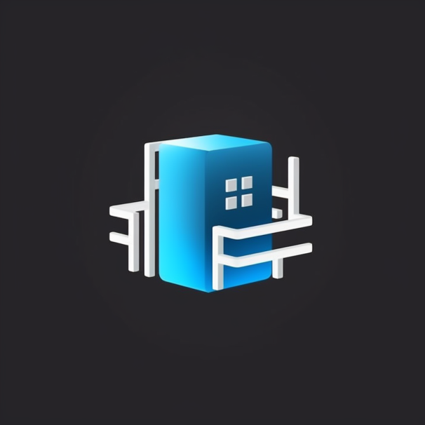

# Roblogic Codespace Template
[](https://bestpractices.coreinfrastructure.org/projects/7341)
[](code_of_conduct.md)
[](https://github.com/genome21/roblogic-codespace-template/actions/workflows/update_devcontainer.yml)



Roblogic Codespace Template is a comprehensive and customizable template for machine learning and deep learning projects with a focus on Python backend and React frontend development. This template is designed to help developers and researchers quickly set up their work environment and focus on building efficient algorithms and models for their machine learning and deep learning tasks.

## Table of Contents

- [Features](#features)
- [Installation](#installation)
- [Usage](#usage)
- [Customization](#customization)
- [Contributing](#contributing)
- [License](#license)
- [Acknowledgments](#acknowledgments)

## Features

- Pre-configured and customizable development environment for Python backend and React frontend projects
- Code organization best practices
- Supports various machine learning and deep learning libraries and frameworks (TensorFlow, PyTorch, scikit-learn)
- Build automation and continuous integration
- Unit testing and performance benchmarking
- Docker and Kubernetes support for scalable deployment

## Installation

1. Clone the repository

```bash
git clone https://github.com/genome21/roblogic-codespace-template.git
```

2. Change directory to the project folder

```bash
cd roblogic-codespace-template
```

3. Install dependencies

```bash
# For Python-based projects
pip install -r requirements.txt

# For React-based projects
cd frontend
npm install
```

## Usage

1. Modify the template to fit your specific project needs (see [Customization](#customization)).
2. Write your machine learning or deep learning code and algorithms in the `src` folder.
3. Add unit tests in the `tests` folder.
4. Use the build system to compile and run your project.

## Customization

This template is built to be easily customizable for a wide range of machine learning and deep learning projects. Here are some steps to help you get started:

1. Update the `README.md` file to reflect your project's description, features, and usage instructions.
2. Adjust the folder structure and namespaces to match your project's requirements.
3. Configure the build system and continuous integration in the `scripts` folder.
4. Modify the Dockerfile and Kubernetes configurations if you are planning to use containerization and orchestration.

## Contributing

Please see the [CONTRIBUTING.md](CONTRIBUTING.md) file for details on how to contribute to this project.

## License

This project is licensed under the MIT License - see the [LICENSE.md](LICENSE.md) file for details.

## Acknowledgments

- The Roblogic Codespace Template is built and maintained by [genome21](https://github.com/genome21) and its contributors.

## Additional Documentation

This repository contains additional documentation to help you understand various aspects of the project:

- [Getting Started Guide](./GETTING_STARTED.md): A guide to help you set up and start using the Roblogic Codespace Template.
- [Updating Devcontainer Configurations](.github/scripts/updating_devcontainer.md): A guide on how to update the `devcontainer.json` file using GitHub Actions.
- [Ensuring a Bus Factor of 2 or More](./BUS_FACTOR.md): Learn how the project addresses the "bus factor" requirement using GitHub Actions for automated updates.
- [Code of Conduct](./CODE_OF_CONDUCT.md): A guide to help you understand the project's code of conduct and how to report unacceptable behavior.
- [Code Review](./CODE_REVIEW.md): A guide to help you understand the project's code review process and how to contribute to the project.
- [Governance](./GOVERNANCE.md): A guide to help you understand the project's governance model.
- [Hardening Headers](./HARDENING_HEADERS.md): A guide to help you understand the project's hardening headers.
- [Legal Mechanisms](./LEGAL_MECHANISMS.md): A guide to help you understand the project's legal mechanisms.
- [Roadmap and Architecture](./ROADMAP_AND_ARCHITECTURE.md): A guide to help you understand the project's roadmap and architecture.
- [Security Assurance](./SECURITY_ASSURANCE.md): A guide to help you understand the project's security assurance.
- [Security Requirements](./SECURITY_REQUIREMENTS.md): A guide to help you understand the project's security requirements.
- [Security Review](./SECURITY_REVIEW.md): A guide to help you understand the project's security review process.
- [Style Guide and Enforcement Policy](./STYLE_GUIDE_AND_ENFORCEMENT.md): A guide to help you understand the project's style guide and enforcement policy and how to contribute to the project.
- [Taks](./TASKS.md): A starting point for new contributors to find tasks to work on.
- [Testing an CI/CD](./TESTING_AND_CI.md): A guide to help you understand the project's testing and CI/CD process.

For more information, please refer to the individual documentation files.
